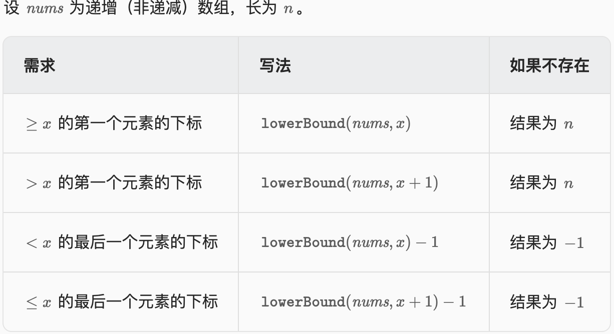

# 零茶山艾府题单及解题思路
# 滑动窗口与双指针

# 2. 二分算法
## 2.1 二分算法基础
```py
{
    """
        找到数组中第一个大于等于target数字的下标, 若数组元素均小于target, 返回数组长度, 若数组元素均大于target, 返回0
    """
    def lower_bound(nums: list, target: int) -> int:
        left, right = 0, len(nums)-1
        while left <= right:
            mid = left + (left + right) // 2
            if nums[mid] >= target:
                right = mid - 1
            else:
                left = mid + 1
        return left
}
```
以上二分算法和其变种的关系如下图所示:  

