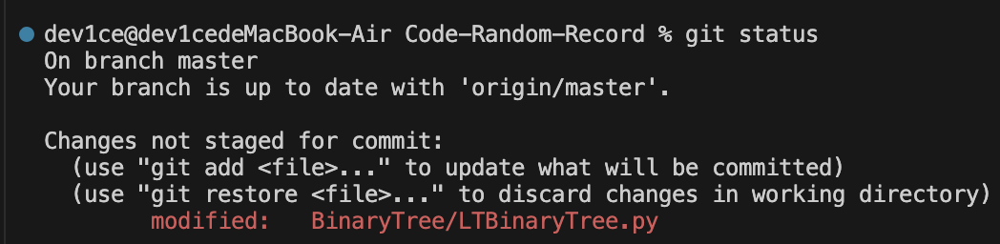
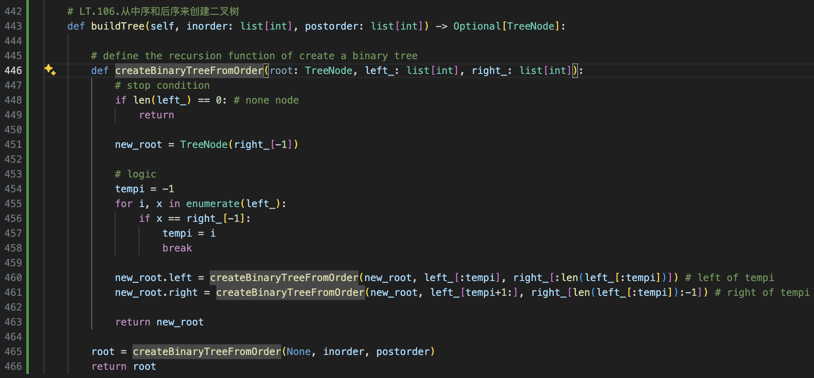

# Recursion in Binary Tree

## LT.106.从中序和后序创建二叉树

> 如何解决递归问题？
1. 传递什么？  
    确定递归函数的**参数** —— 即在递归过程中需要*持有*和*更新*的变量，如果用迭代（栈模拟）的角度来看，即需要被栈记录的变量
2. 执行什么？  
    递归的逻辑，  
    若以二叉树为例，通常是在递归函数中执行二叉树的遍历过程
3. 什么时候停止？
    递归的停止条件：
    以二叉树为例，通常是在当前节点为空，即叶子节点的下一次递归调用使得当前节点为空

