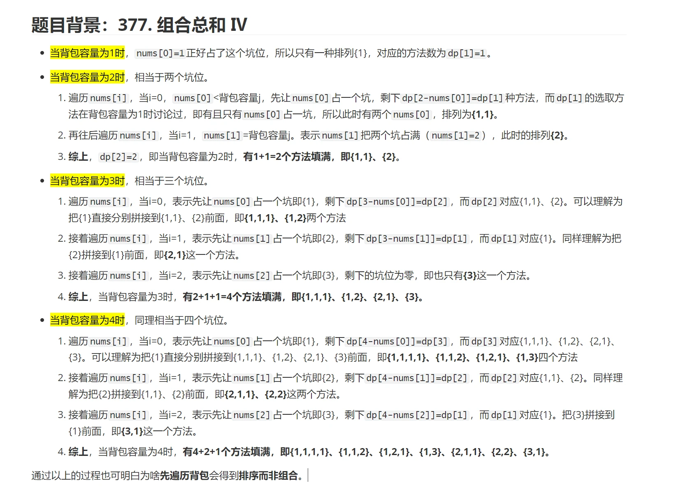

# How to use dynamic programing?
1. 明确DP数组及下标i的含义
2. 推导**递推公式**
3. DP数组如何初始化
4. 确定DP数组的遍历顺序
5. 打印DP数组
# framework

# 基础

# 背包问题
## 01背包问题
**递归五部曲**  
1. dp[i][j]: [0, i]之间的物品任取，每个物品只取一次，放入容量为j的背包中的价值  
2. 两种情况
    - 不放物品i最大价值：`dp[i-1][j]`  
    - 放入物品i最大价值：`dp[i-1][j - weight[i]] + value[i]`  
3. 状态转移方程：`dp[i][j] = max(dp[i-1][j], dp[i-1][j - weight[i]] + value[i])`  
4. 初始化：第一列 - 背包容量为0时的价值均为0；第一行，只选择第一种物品在不同背包容量下的价值
5. 遍历dp数组
## 完全背包问题
**递归五部曲**
1. dp[i][j]：从下标为[0...i]之间的物品任取，每个物品可以取无数次，放入容量为j的背包中的价值最大和
2. 两种情况
    - 不放入物品i时的最大价值： `dp[i-1][j]`
    - 放入物品i时的最大价值：`dp[i][j-weight[j]] + value[i]`，在放入物品i时，行下标仍然为i，因为可能会放入多次下标为i的物品
3. 状态转移方程：`dp[i][j] = max(dp[i-1][j], dp[i][j-weight[i]]+values[i])`
4. 初始化：
    - 第一列：背包容量为0的情况下，价值均为0
    - 第一行：当背包容量`j >= weight[0]`时，初始化`dp[0][j] = dp[0][j-weight[0]] + value[0]`
5. 遍历顺序
    - 先物品，后背包
    - 先背包，后物品

> 完全背包问题  
1. LeetCode.377.组合总和4    
2. 本题本质是求排列个数, （推荐）使用一维dp来解决, 要求排列树，在一维dp中先遍历背包, 再遍历物品, 可以求出不同排列, 原理分析如图所示:

# 打家劫舍

# 股票问题

# 子序列问题